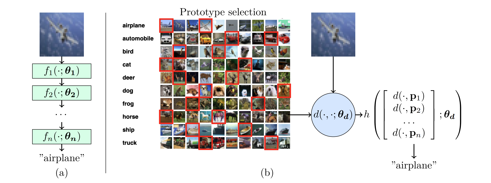
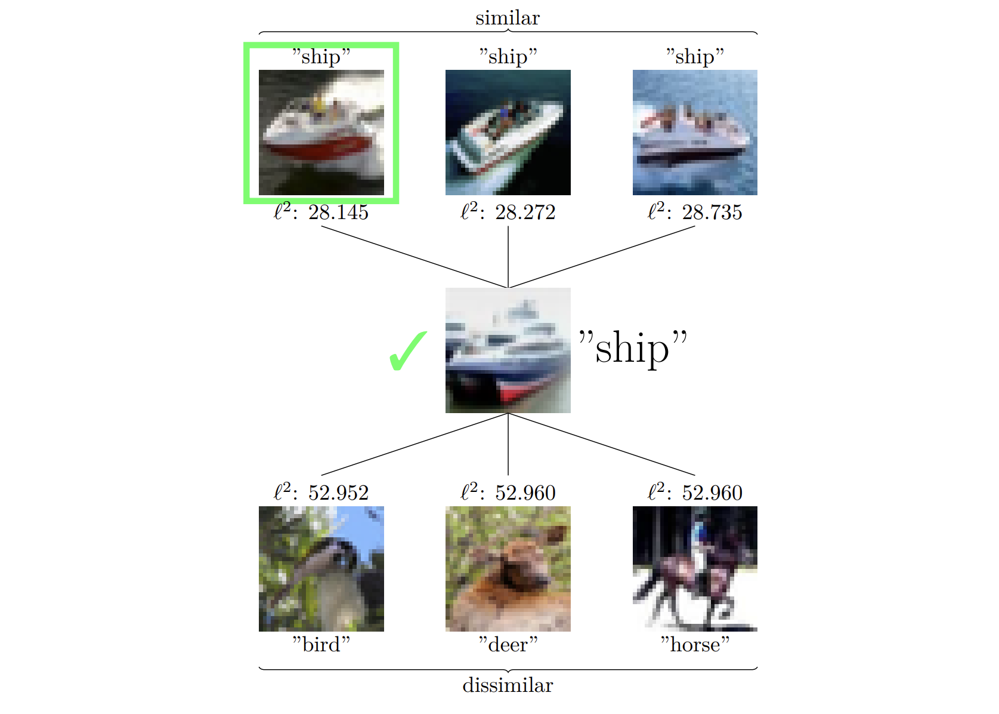
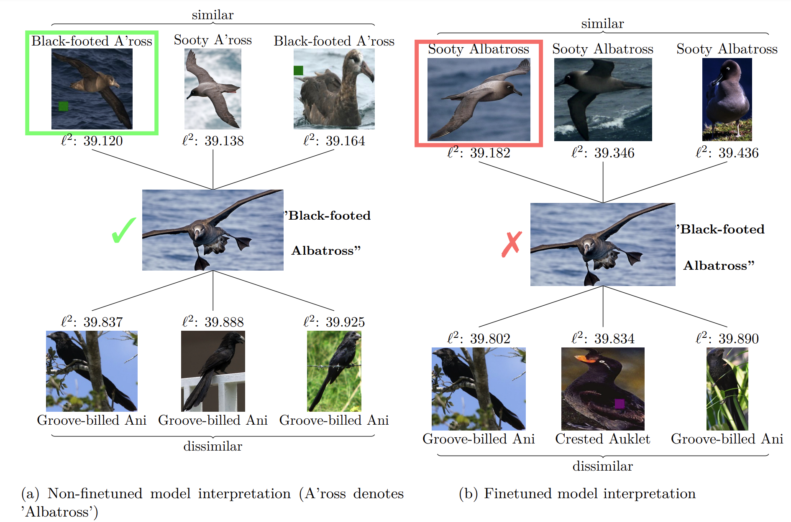

# IDEAL: Interpretable-by-design deep learning algorithms
 

 Plamen Angelov, Dmitry Kangin, Ziyang Zhang ** IDEAL: Interpretable-by-design deep learning algorithms **. ([paper link](https://arxiv.org/abs/2311.11396)). 

 # Overview 

 This repository is the implementation of the paper "IDEAL: Interpretable-by-design deep learning algorithms".

The proposed IDEAL (Interpretable-by-design DEep learning ALgorithms) tackles the problem of interpretable transfer learning by recasting the standard supervised classification problem into a function of similarity to a set of prototypes derived from the training data.

## Architecture Comparison 

Difference between (a) a standard deep-learning model, and (b) the proposed prototype-based approach, IDEAL. Dataset credit: CIFAR-10.

  
  

## IDEAL decision-making process

Interpreting the predictions of the proposed model (k-means (nearest), CIFAR-10, ViT).

  
  

## Class-incremental learning on iCIFAR-10

Here we show the evolution of prototype ranking on iCIFAR-10.

  
  

## Interpretations comparison on the non-finetuned and finetuned model

Here we show the interpretations comparison on the non-finetuned and finetuned model with confounding on confounded CUB dataset.

  
  

